# Plano Codex-first do AutoAIBuilder

> Orientação vigente a partir de 30/07/2026.  
> Esta decisão preserva o software existente, mas retira seu desenvolvimento
> do caminho crítico até que as funcionalidades sejam validadas diretamente no
> Codex.

## 1. Decisão de produto

O AutoAIBuilder desktop entra em **pausa funcional controlada**.

Isso significa:

- preservar integralmente o código, os testes, a documentação, os bancos e os
  artefatos já produzidos;
- não descartar a interface nem a arquitetura do software;
- não abrir novas frentes de interface, persistência ou empacotamento enquanto
  elas não forem necessárias para validar uma funcionalidade;
- usar o código atual como biblioteca de conhecimento, algoritmos, contratos e
  casos de regressão;
- desenvolver e homologar primeiro as skills e os agentes executados
  diretamente pelo Codex;
- retomar o produto desktop quando máscara, coordenadas e o primeiro
  lançamento elétrico estiverem comprovados no fluxo real.

Correções indispensáveis para preservar um teste ou expor uma capacidade
determinística ao Codex continuam permitidas. Evoluções de produto que não
reduzam o risco das skills ficam congeladas.

## 2. Objetivo imediato

Entregar, nesta ordem:

1. identificação supervisionada de símbolos e pontos em um DWG;
2. coordenadas WCS visualmente confirmadas;
3. transformação global entre DWG e Builder calibrada e auditável;
4. deslocamento local da peça validado por tipo e orientação;
5. uma automação elétrica mínima no Builder, supervisionada ponto a ponto;
6. skills e agentes reutilizáveis para repetir o processo sem depender da
   interface WPF.

O primeiro piloto elétrico será uma tomada média em projeto de teste. A escolha
entre 10 A e 20 A deve vir da máscara ou de confirmação profissional; não pode
ser deduzida apenas pela potência aparente da peça.

## 3. Inventário confirmado

### 3.1 Repositório do software

- solução .NET 8 WPF com camadas Domain, Application, Infrastructure e Desktop;
- 148 testes automatizados aprovados em 30/07/2026;
- reconhecimento CAD AAR v3;
- exportação visual AIV v2;
- leitura de `TEXT`, `MTEXT`, `ATTRIB`, blocos e hierarquia expandida;
- conversão OCS para WCS;
- correção de ponto-base remoto por limites ou geometria expandida;
- interpretação conservadora de legenda;
- revisão humana e auditoria;
- execução CAD em cópia técnica com proteção por SHA-256;
- modo de preservação total 11.6H.1;
- nenhuma skill de projeto ou agente especializado já instalado no repositório.

O worktree contém alterações recentes ainda não consolidadas. Elas pertencem ao
projeto e devem ser preservadas. A pausa não autoriza limpeza, descarte ou
reversão dessas mudanças.

### 3.2 Acervo histórico `Automacao_CAD`

Foram confirmados:

- DWG arquitetônico original;
- máscaras automáticas V05 e V06;
- máscara manual;
- nove rotinas AutoLISP V01 a V081;
- CSVs de análise, classificação, legenda, pontos, componentes, auditoria e
  direções;
- resultados reais do 11.6H/11.6H.1.

Linha de base histórica:

| Evidência | Resultado |
|---|---:|
| Pontos principais | 272 |
| Pontos elétricos | 196 |
| Pontos hidráulicos | 76 |
| Componentes/textos associados | 100 |
| Layers semânticas | 35 |
| Diagnósticos de direção | 38 |
| Direções a revisar | 2 |
| Offsets validados no Builder | 15 |
| Offsets inferidos por simetria | 23 |

Distribuição dos 38 diagnósticos:

| Direção | Casos | Offset local em cm | Estado |
|---|---:|---|---|
| Esquerda | 9 | `(+2,4; -1,5)` | validado no Builder |
| Baixo | 6 | `(+1,5; +2,4)` | validado no Builder |
| Direita | 12 | `(-2,4; +1,5)` | inferido por simetria |
| Cima | 11 | `(-1,5; -2,4)` | inferido por simetria |

Dois símbolos `EGT`, com ângulo efetivo aproximado de `222,23°`, continuam
marcados para revisão de direção.

### 3.3 Última sessão real de reconhecimento

Fonte: `Elétrico - Maíra e Pedro.dwg`.

| Evidência | Resultado real |
|---|---:|
| Registros AAR v3 | 9.421 |
| Inserções | 581 |
| Inserções expandidas | 34 |
| Candidatos atuais | 513 |
| Candidatos relacionados à legenda | 161 |
| Âncoras por inserção WCS | 243 |
| Âncoras por limites WCS | 114 |
| Âncoras por geometria expandida WCS | 156 |
| Pares de legenda propostos | 28 |
| Descrições de legenda sem par | 12 |
| Candidatos já revisados | 0 |
| Comandos de mutação no original | 0 |

Os documentos anteriores registram 511 candidatos em um ensaio. A sessão mais
recente contém 513; a nova linha de base deve usar o artefato real mais recente
e registrar a diferença, sem reescrever a evidência antiga.

## 4. O que está comprovado e o que ainda falta

| Assunto | Estado | Decisão |
|---|---|---|
| Inventário somente leitura | comprovado | reutilizar |
| Integridade do DWG original | comprovado | manter SHA-256 antes/depois |
| Conversão para WCS | comprovada tecnicamente | validar amostra visual |
| Correção de pontos-base remotos | comprovada tecnicamente | validar por origem da âncora |
| Leitura de textos e acentos | comprovada | reutilizar |
| Interpretação da legenda | implementada e conservadora | revisar os 28 pares |
| Símbolos aninhados | implementados no AAR v3 | revisar casos recuperados |
| 513 candidatos do DWG novo | não homologados | revisar no Codex |
| Transformação global DWG → Builder | parcialmente observada | calibrar com pontos de controle |
| Offset local para esquerda/baixo | validado em casos históricos | reproduzir no piloto |
| Offset local para direita/cima | hipótese por simetria | validar no Builder |
| Automação geral do Builder | não implementada | manter fora do escopo |
| Um lançamento elétrico supervisionado | fluxo manual já observado | primeiro piloto |

“Implementado” não significa “homologado”. A identificação do DWG novo só passa
a ser uma capacidade validada depois da conferência visual e do registro dos
acertos, ausências e falsos positivos.

## 5. Contrato correto de coordenadas

As coordenadas devem ser tratadas em quatro espaços distintos:

1. **Entidade CAD original** — ponto de inserção e geometria originais.
2. **Âncora WCS de reconhecimento** — ponto usado para identificar visualmente
   o símbolo na planta.
3. **Coordenada de modelo no Builder** — resultado da transformação global.
4. **Coordenada de clique na tela** — posição temporária da interface,
   dependente de zoom, janela e monitor.

Nunca persistir coordenada de tela como se fosse coordenada de engenharia.

Antes de usar qualquer coordenada, rotular a entidade como exemplar da
legenda ou ocorrência real da planta. A legenda ensina a semântica, mas sua
posição nunca é coordenada de lançamento. O AAR trabalha em WCS; o painel
Propriedades pode mostrar o UCS atual e exige uma transformação explicitamente
validada. Escala informada, fator de unidade e escala efetiva também permanecem
separados.

Modelo:

```text
P_ancora_wcs =
    ResolveAncora(P_insercao, limites, geometria_expandida)

P_builder_modelo =
    TransformacaoGlobal(P_ancora_wcs)
    + OffsetLocal(tipo, altura, orientacao)

P_tela =
    ProjecaoTemporariaDaInterface(P_builder_modelo, viewport_atual)
```

### 5.1 Transformação global

A transformação global deve ser calibrada separadamente do offset da peça.

Requisitos:

- usar pontos de controle distribuídos na planta;
- manter coordenadas de origem e destino;
- registrar unidade de cada lado;
- identificar o modelo matemático usado;
- calcular resíduos por ponto;
- reservar pelo menos um ponto para validação independente;
- solicitar ao usuário o limite de erro aceitável antes da homologação;
- invalidar a calibração quando escala, origem, pavimento ou arquivo mudar.

Não deduzir uma transformação universal a partir de um único lançamento
“perfeito”.

### 5.2 Offset local

O offset local pertence à combinação:

```text
tipo de ponto + peça Builder + altura + orientação
```

Cada combinação deve registrar:

- valor X/Y/Z;
- unidade;
- origem da evidência;
- quantidade de repetições;
- arquivo e pavimento;
- estado `VALIDADO`, `INFERIDO` ou `PENDENTE`;
- evidência antes/depois.

Direita e cima permanecem bloqueadas para execução automática enquanto forem
apenas inferidas por simetria.

### 5.3 Orientação visual

Preservar a rotação bruta da referência de bloco, mas não tratá-la como direção
final. A orientação efetiva deve considerar o eixo nativo do símbolo, a
transformação completa, escalas negativas ou espelhamento, hierarquia, parede
próxima e lado do ambiente. Quando a imagem não for conclusiva, manter a
direção pendente em vez de aplicar automaticamente a tabela dos quatro ângulos.

## 6. Arquitetura Codex-first

```mermaid
flowchart LR
    A["DWG em cópia técnica"] --> B["Skill analisar-mascara-cad"]
    B --> C["Inventário + legenda + candidatos"]
    C --> D["Agente de máscara: revisão com o usuário"]
    D --> E["Manifesto semântico aprovado"]
    E --> F["Skill calibrar-coordenadas-builder"]
    F --> G["Calibração global + offsets locais"]
    G --> H["Agente Builder elétrico"]
    H --> I["Skill lançar-ponto-elétrico"]
    I --> J["Prévia, confirmação, execução e auditoria"]
```



O software desktop não fica entre o usuário e essas etapas. Ele fornece
algoritmos e evidências que serão reaproveitados por scripts e referências das
skills.

## 7. Skills propostas

### 7.1 `analisar-mascara-cad`

Responsabilidade:

- receber um DWG;
- criar ou exigir uma cópia técnica;
- calcular SHA-256;
- executar inventário somente leitura pelo AutoCAD Core Console;
- interpretar entidades, textos, hierarquia e legenda;
- gerar candidatos com coordenadas WCS e evidência;
- conduzir revisão visual;
- produzir um manifesto semântico aprovado.

Recursos reutilizáveis:

- exportador de inventário AAR v3;
- `CadEntityInventoryParser`;
- `CadExpandedGeometryAnchorResolver`;
- `CadLegendInterpreter`;
- regras conservadoras de `CadRecognitionService`;
- linha de base V07/V081;
- exemplos reais e testes sintéticos.

Saídas mínimas:

- `inventory.aar`;
- `legend-catalog.json`;
- `recognition-candidates.json`;
- `review-decisions.jsonl`;
- `mask-recognition-manifest.json`.

Restrições:

- nunca alterar o DWG original;
- nunca apagar, explodir ou mover entidades no original;
- não autoaprovar pareamentos da legenda;
- não ocultar símbolos sem classificação;
- separar claramente ponto de inserção e âncora visual.

### 7.2 `calibrar-coordenadas-builder`

Responsabilidade:

- receber pontos WCS aprovados;
- coletar pontos correspondentes no Builder;
- estimar e validar a transformação global;
- gerenciar offsets locais por peça e orientação;
- calcular resíduos;
- produzir um contrato de calibração reutilizável.

Saídas mínimas:

- `coordinate-control-points.csv`;
- `builder-coordinate-calibration.json`;
- `local-piece-offsets.json`;
- `coordinate-validation-report.md`.

Restrições:

- não executar lançamentos em lote;
- não misturar pixel de tela com coordenada de modelo;
- não promover inferência por simetria a validação;
- não reutilizar calibração em arquivo/pavimento incompatível.

### 7.3 `lancar-ponto-eletrico-builder`

Responsabilidade:

- receber um único ponto aprovado e uma calibração válida;
- verificar o estado visível do Builder;
- apresentar o plano do lançamento;
- selecionar rede, posição, comando e peça;
- aplicar ponto relativo e orientação;
- solicitar confirmação humana nos portões definidos;
- capturar evidência antes/depois e registrar o resultado.

Primeiro caso:

- uma tomada média;
- um projeto e pavimento de teste;
- uma cópia recuperável;
- confirmação a cada ponto;
- sem circuitos, dimensionamento ou lote.

Restrições:

- não escolher 10 A/20 A sem evidência;
- não continuar quando a tela não corresponde ao estado esperado;
- não usar direita/cima antes da validação real;
- não salvar, sobrescrever ou fechar projeto sem autorização explícita;
- oferecer caminho de cancelamento e desfazer.

## 8. Agentes propostos

### 8.1 Agente de máscara

Usa `analisar-mascara-cad` e, depois, `calibrar-coordenadas-builder`.

Funções:

- organizar a sessão;
- apresentar lotes pequenos de revisão;
- registrar correções sem alterar a origem;
- manter a fila de pendências;
- emitir o manifesto apenas quando os portões forem satisfeitos.

### 8.2 Agente Builder elétrico

Usa `lancar-ponto-eletrico-builder` e o contrato de calibração aprovado.

Funções:

- verificar pré-condições;
- executar somente o próximo passo autorizado;
- parar em divergência visual;
- registrar screenshots, parâmetros e resultado;
- nunca ampliar de um ponto para lote por conta própria.

Nesta primeira fase, auditoria e coordenação geral permanecem com o Codex
principal. Um terceiro agente aumenta a complexidade sem resolver o gargalo
atual.

## 9. Matriz de reaproveitamento

| Material atual | Destino Codex-first | Tratamento |
|---|---|---|
| AAR v3 e exportador AutoLISP | skill de máscara | reutilizar |
| Parser AAR | script determinístico | reutilizar/adaptar |
| Resolvedor de âncora | script determinístico | reutilizar |
| Interpretador de legenda | skill de máscara | reutilizar |
| Heurísticas de reconhecimento | referência versionada | normalizar |
| CSV V07/V081 | regressão e exemplos | reutilizar |
| Revisão WPF | conversa, tabelas e imagem | adaptar |
| SQLite | auditoria JSON/CSV inicial | adiar |
| Visualizador WPF | evidência visual disponível | não tornar obrigatório |
| Segurança 11.6H.1 | todos os agentes | reutilizar como portões |
| Rotinas de limpeza V06 | arquivo histórico | bloquear |
| Fluxo manual do Builder | skill elétrica | formalizar |
| Automação geral do Builder | etapa futura | adiar |

## 10. Frentes de trabalho reorganizadas

### Frente A — Fonte da verdade e preservação

Estado: iniciada.

- manter este documento como rota vigente;
- preservar o worktree e os artefatos externos;
- gerar inventário com caminhos, hashes e versões relevantes;
- congelar novas funcionalidades do desktop;
- registrar divergências entre documentação e artefatos reais.

Saída: pacote de referência estável para as skills.

### Frente B — Homologação da máscara no DWG novo

Estado: próxima frente ativa.

1. revisar visualmente os 28 pares de legenda;
2. registrar as 12 descrições sem par;
3. revisar amostras de cada origem de âncora:
   `INSERTION_WCS`, `BOUNDS_CENTER_WCS` e
   `EXPANDED_GEOMETRY_CENTER_WCS`;
4. validar os símbolos recuperados por hierarquia;
5. registrar falsos positivos, ausências e duplicações;
6. fechar a lista de pontos elétricos do pavimento piloto.

Saída: manifesto semântico aprovado para um DWG novo.

### Frente C — Homologação das coordenadas

Estado: bloqueada pela Frente B.

1. fixar unidade e sistema de coordenadas;
2. selecionar pontos de controle distribuídos;
3. obter correspondências no Builder;
4. calcular transformação global e resíduos;
5. validar um ponto reservado;
6. repetir esquerda e baixo;
7. validar realmente direita e cima;
8. separar offsets por peça/tipo/altura.

Saída: contrato de calibração aprovado.

### Frente D — Skills e agentes

Estado: desenho concluído; implementação após definir local de instalação.

Ordem:

1. `analisar-mascara-cad`;
2. Agente de máscara;
3. `calibrar-coordenadas-builder`;
4. `lancar-ponto-eletrico-builder`;
5. Agente Builder elétrico.

Cada skill deve ter `SKILL.md` curto, recursos detalhados em `references/`,
scripts determinísticos quando necessários e metadados em `agents/openai.yaml`.
Cada uma deve passar pelo validador de skills e por ensaios reais.

### Frente E — Primeiro piloto elétrico no Builder

Estado: bloqueada pelas Frentes B, C e D.

1. usar projeto de teste;
2. lançar uma tomada média;
3. confirmar rede e posição;
4. confirmar peça 10 A/20 A;
5. aplicar coordenada global e offset local;
6. confirmar orientação;
7. comparar antes/depois;
8. desfazer e repetir quando necessário;
9. exigir repetibilidade antes de testar um microlote.

Saída: primeiro lançamento elétrico auditável diretamente pelo Codex.

### Frente F — Retomada do software

Estado: pausada.

Critério de retomada:

- skill de máscara homologada em mais de um desenho;
- calibração reproduzível;
- primeiro ponto elétrico repetível;
- formato dos contratos estabilizado;
- tarefas manuais e falhas reais conhecidas.

Quando retomado, o software incorporará contratos já comprovados em vez de
servir como laboratório primário.

## 11. Portões de aceitação

### Máscara M1

- original íntegro por SHA-256;
- legenda revisada;
- candidatos do pavimento piloto classificados;
- ausências e falsos positivos registrados;
- coordenada e origem da âncora visíveis;
- nenhum exemplar da legenda tratado como ponto da planta;
- manifestação explícita do usuário aprovando o conjunto.

### Coordenadas C1

- WCS e unidade confirmados;
- transformação global separada do offset local;
- pontos de controle e resíduos registrados;
- ponto independente aprovado;
- tolerância aprovada pelo usuário;
- quatro direções testadas no Builder;
- calibração vinculada ao arquivo e pavimento.

### Builder B1

- projeto de teste/cópia;
- plano exibido antes da ação;
- estado da interface conferido;
- peça e amperagem confirmadas;
- um único ponto lançado;
- resultado visual aprovado;
- log e evidências preservados;
- caminho de desfazer testado.

### Repetibilidade B2

- várias execuções consecutivas aprovadas pelo usuário;
- nenhuma ação fora do plano;
- falhas interrompem o fluxo com segurança;
- somente então permitir microlote supervisionado.

## 12. Próxima sequência operacional

1. escolher o local versionado e o local instalado das skills;
2. inicializar `analisar-mascara-cad` pelo gerador oficial de skills;
3. extrair apenas os recursos necessários do software;
4. validar a skill;
5. usar a última sessão real para revisar a legenda e as âncoras;
6. fechar o manifesto do pavimento piloto;
7. criar e validar `calibrar-coordenadas-builder`;
8. coletar os pontos de controle no Builder;
9. validar direita e cima;
10. criar `lancar-ponto-eletrico-builder`;
11. executar um lançamento supervisionado;
12. registrar aprendizados nos recursos das skills;
13. retomar o software somente após os portões M1, C1 e B1.

## 13. Decisões que continuam humanas

- quais símbolos da legenda estão corretos;
- quais pontos pertencem ao projeto elétrico;
- tolerância aceitável de posicionamento;
- escolha 10 A/20 A quando a máscara não for conclusiva;
- peça correta do catálogo Builder;
- aprovação visual do lançamento;
- autorização para salvar ou avançar para lote;
- responsabilidade técnica final.

## 14. Estado da implementação Codex-first

Atualizado em 02/08/2026.

Implementado:

- fonte versionada das três skills em `codex/skills/`;
- instalação pessoal em `%USERPROFILE%\.codex\skills`;
- agente de máscara em `.codex/agents/agente-mascara.toml`;
- agente Builder elétrico em
  `.codex/agents/agente-builder-eletrico.toml`;
- instruções persistentes do projeto em `AGENTS.md`;
- inspeção determinística de `session.json` com verificação SHA-256;
- exportação AAR v3 direta pelo AutoCAD Core Console sobre cópia técnica;
- cálculo determinístico de transformação de similaridade 2D e resíduos;
- contratos de revisão, calibração e auditoria do lançamento.
- exportação direta das filas de legenda e candidatos para CSV.
- consolidação das regras luminotécnicas em referência de regressão separada
  das regras universais;
- validação determinística de pacote aprovado, coordenadas, decisões, perfis,
  orientações, evidências e SHA-256 por
  `scripts/validate_mask_package.py`;
- revisão visual por ambiente com registro ponto a ponto preservado em
  JSON/CSV.

Validação realizada:

- três skills aprovadas por `quick_validate.py`;
- YAML dos metadados e TOML dos agentes analisados com sucesso;
- sessão real mais recente reproduzida com 513 candidatos, 28 pares de legenda
  e SHA-256 original confirmado;
- calibração sintética recuperada com escala 1, rotação 0 e translação
  `(100, 200)`;
- DWG histórico pequeno inventariado diretamente no Core Console;
- 15.455 registros AAR v3 gerados;
- SHA-256 do DWG antes e depois:
  `1D01A76F23D8689DB4DF58F9A330F48F415E5F0509A46E1E3F85C8F7754ADDF3`;
- zero comandos dirigidos ao original.
- fila real criada para a sessão
  `f31ed923-6e83-4a1a-8f41-0c15f8718a47`, com 28 pares de legenda e 513
  candidatos pendentes.
- luminotécnico do térreo aprovado: 60 ocorrências fixas, 20 segmentos de
  perfil e 13 entidades de ponto LED sem caixa em 12 posições;
- luminotécnico do segundo pavimento aprovado: 57 ocorrências fixas, 12
  segmentos e 17 pontos LED sem caixa, totalizando 86 unidades;
- os dois pacotes luminotécnicos passaram no validador, incluindo releitura do
  SHA-256 dos DWGs originais.

Pendente:

- portar a geração semântica completa de candidatos para fora do WPF;
- concluir e aprovar o pacote completo de `PONTOS TÉRREO`;
- revisar visualmente os 28 pares da legenda;
- homologar amostras das três origens de âncora;
- coletar pontos de controle no Builder;
- validar direita e cima;
- executar o primeiro lançamento supervisionado.
